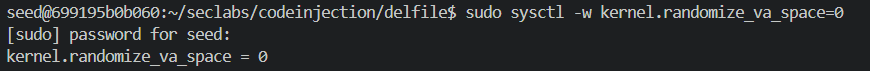
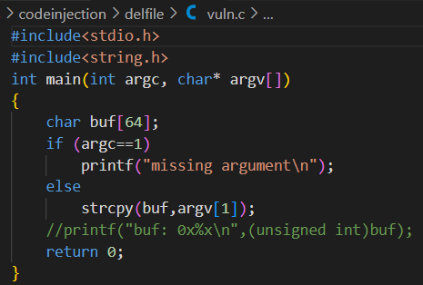
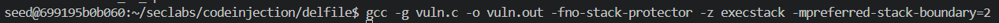

# 21110755, Phạm Văn Cao

#Lab#2 Inject code to delete file: file_del.asm is given on github 

## I. Setup enviroment.
The command `sudo sysctl -w kernel.randomize_va_space=0` is used to disable Address Space Layout Randomization (ASLR) on the system.The image below shows the execution of this command.

The code has a **buffer overflow** vulnerability because `strcpy()` is used without checking the length of the input string, which can cause memory overwrite if the input is too long.

We then proceed to compile the program using the following options.
The command `gcc -g vuln.c -o vuln.out -fno-stack-protector -z execstack -mpreferred-stack-boundary=2` compiles the `vuln.c` file with several flags:
- `-g` includes debugging information.
- `-fno-stack-protector` disables stack protection, making the program more vulnerable to buffer overflows.
- `-z execstack` allows the stack to be executable, which can enable the execution of injected code.
- `-mpreferred-stack-boundary=2` changes the stack alignment to 4 bytes, which can influence how memory is allocated.

