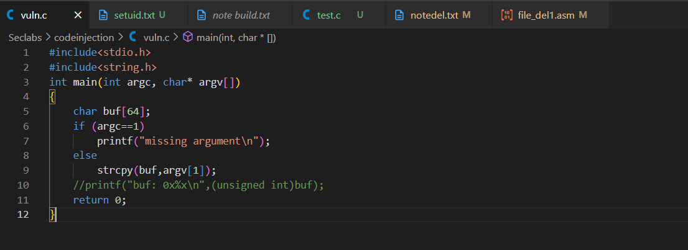
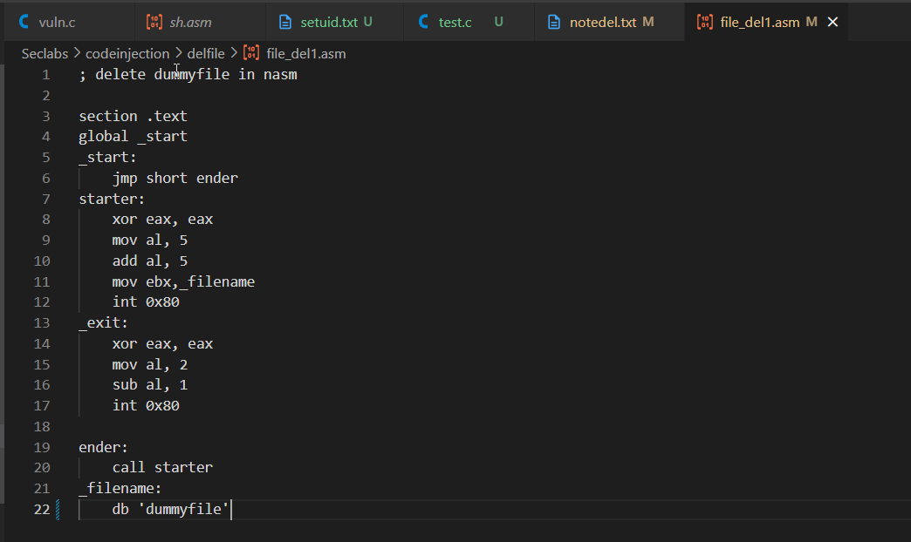
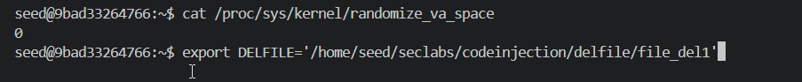
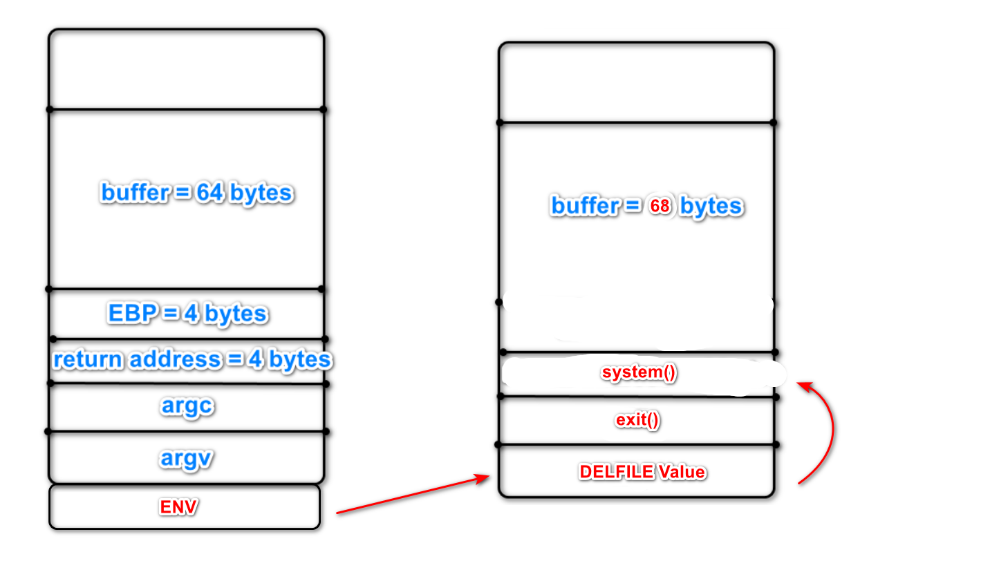
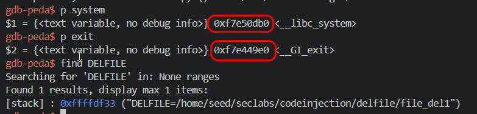
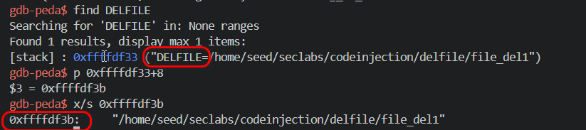
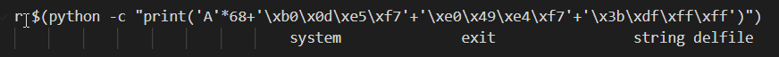
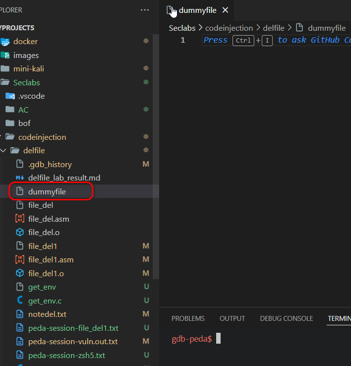
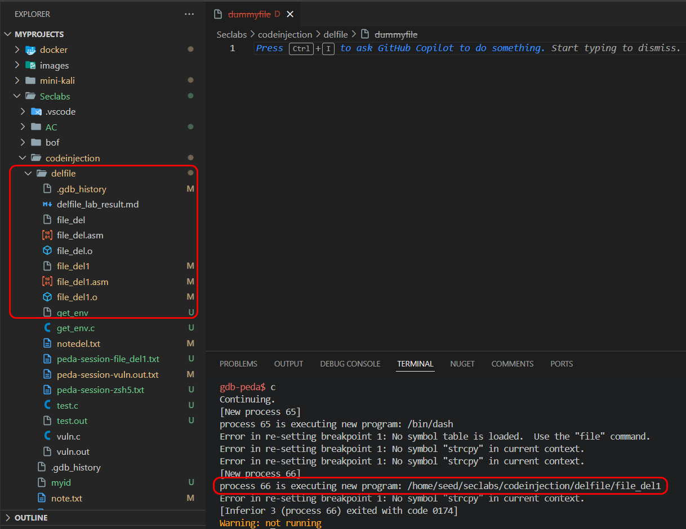

# 21110755, Phạm Văn Cao

#Lab2. Using return to libc and ENV to del file dummy

In this lab, the goal is to use Return to Libc to execute an encrypted shell file while running the vulnerable program by injecting an environment variable.

#I. Enviroment setup

I compile a program with a buffer overflow vulnerability at the strcpy() function and create a shellcode to delete a file named dummy

Disable the mode using the command sudo sysctl -w kernel.randomize_va_space=0 and set the environment variable using export DELFILE='/home/seed/seclabs/codeinjection/delfile/file_del1'

With the stack frame of the C program, we perform the buffer overflow by writing 68 bytes until the address of the return address, then we overwrite it with the address of the system() function to replace the EIP. After the address of the system() function, we place the address of the exit() function to exit the program safely, followed by the value of the DELFILE environment variable, which serves as the argument for the system() function to execute the shellcode.

First, we quickly find the addresses of the system() and exit() functions using the commands print system and print exit in gdb-peda.

Next, we find the address of the argument for the system() function. First, we locate the address of the environment variable DELFILE using the command find DELFILE. After that, we see that the first 8 bytes contain the name of the environment variable, and by calculating the assignment =, we can add 8 bytes to access the string value of the DELFILE variable.

Then, we create a simple payload using Python

In conclusion, we have successfully executed the shellcode and deleted the dummy file.

